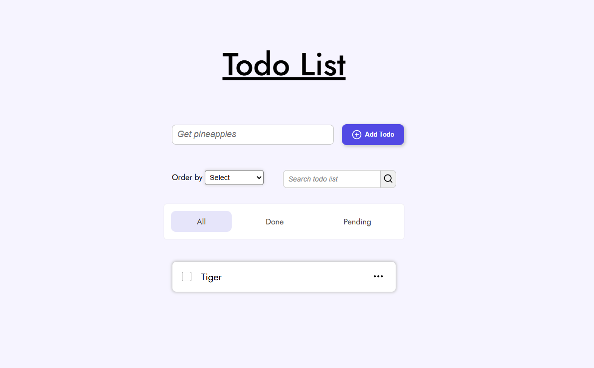

---

# To-Do List App

A responsive To-Do List app built using **HTML**, **CSS**, and **JavaScript**. It allows users to manage tasks efficiently with advanced filtering, search, and sorting features.

## Features

- Add, Edit, Delete tasks
- Mark tasks as **Done** or **Pending**
- **Search** tasks within selected filters (e.g. search only pending todos)
- **Filter** by:
  - All
  - Done
  - Pending
- **Order By**:
  - Last Modified
  - Newest First
  - Oldest First
- Fully **Responsive** design for mobile and desktop

## Tech Stack

- **HTML**: Structure of the application.
- **CSS**: Styling for an intuitive and minimal design.
- **JavaScript**: Handles task management and interactions.

## Deployment

This web app is deployed using [Vercel](https://vercel.com/) by Tiger. You can access the live version here: [Todo List App](https://simple-todo-app-orpin-omega.vercel.app/)

## ScreenShots

## Getting Started

To run the app locally:

1. Clone this repository.
2. Navigate to the project folder.
3. Open `index.html` in your browser.

## License

This project is licensed under the MIT License - see the [LICENSE](LICENSE) file for details.

## Author

Made with ❤️ by Tiger

---